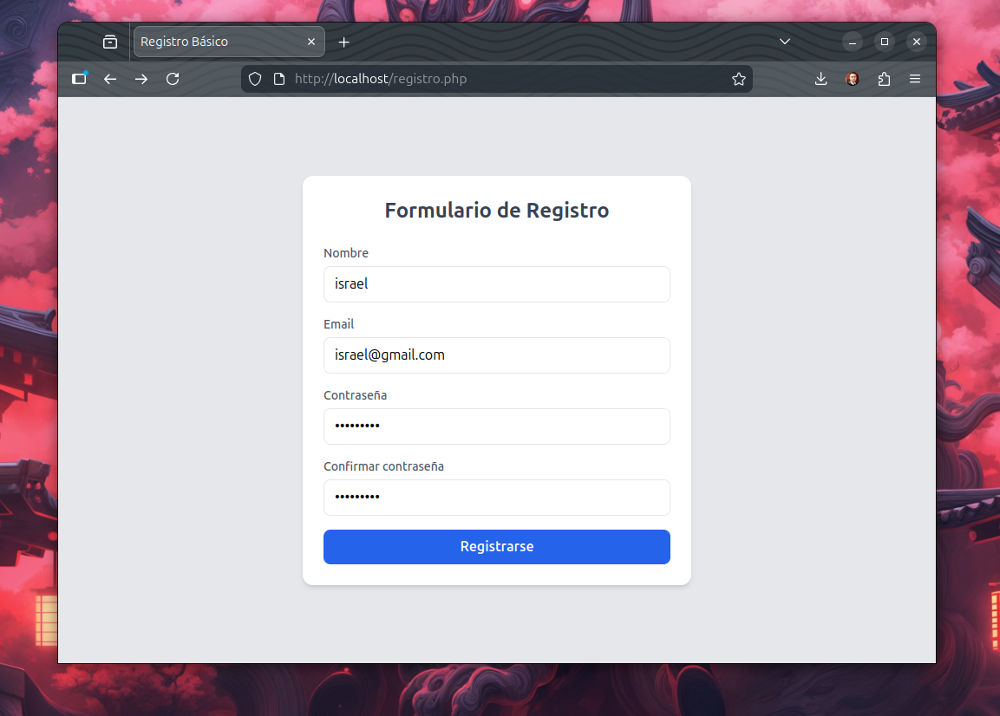

# Formulario de Registro Básico - PHP

<p align="center">
  
</p>

Un sistema de registro de usuarios simple y funcional desarrollado en PHP con validación del lado del servidor y una interfaz moderna construida con Tailwind CSS.

## 📋 Características

- ✅ Formulario de registro responsivo
- ✅ Validación de datos en tiempo real
- ✅ Encriptación segura de contraseñas (PASSWORD_DEFAULT)
- ✅ Diseño moderno con Tailwind CSS
- ✅ Compatible con Windows y Linux
- ✅ Sin base de datos - ideal para aprendizaje y prototipos

## 🛠️ Requisitos Previos

### Para Windows

- XAMPP, WampServer o MAMP (incluye Apache + PHP)
- Navegador web moderno (Chrome, Firefox, Edge)

### Para Linux (Ubuntu/Debian)

```bash
# Instalar Apache y PHP
sudo apt update
sudo apt install apache2 php php-cli libapache2-mod-php

# Habilitar Apache
sudo systemctl enable apache2
sudo systemctl start apache2

# Habilitar módulo PHP
sudo a2enmod php
sudo systemctl restart apache2
```

## 🚀 Instalación y Configuración

### Método 1: XAMPP (Windows)

1. Instala XAMPP desde [xampp.org](https://xampp.org/)
2. Inicia Apache desde el panel de XAMPP
3. Copia los archivos a `C:/xampp/htdocs/formulario/`
4. Abre `http://localhost/formulario/registro.php` en tu navegador

### Método 2: Apache Nativo (Linux)

1. Copia los archivos al directorio web:

```bash
# Opción A: Directorio por defecto
sudo cp -r . /var/www/html/formulario/

# Opción B: VirtualHost (recomendado)
sudo mkdir -p /var/www/formulario
sudo cp -r * /var/www/formulario/
sudo chown -R www-data:www-data /var/www/formulario/
```

1. Configurar permisos:

```bash
sudo chmod -R 755 /var/www/formulario/
```

1. Accede desde el navegador:

- **Localhost:** `http://localhost/formulario/registro.php`
- **Si usaste IP:** `http://TU_IP/formulario/registro.php`

### Método 3: Servidor PHP Development (Rápido)

Para pruebas rápidas sin Apache:

```bash
# En el directorio del proyecto
php -S localhost:8000

# Luego accede a: http://localhost:8000/registro.php
```

## 📁 Estructura de Archivos

```
register-form-php/
├── registro.php          # Formulario HTML + Tailwind CSS
├── procesar.php          # Lógica de validación y procesamiento
└── README.md            # Esta documentación
```

## 🔍 Funcionalidad Detallada

### registro.php

- Formulario HTML5 semántico
- Campos: Nombre, Email, Contraseña, Confirmar contraseña
- Estilos responsive con Tailwind CSS v3
- Validación HTML5 básica

### procesar.php

- Verificación del método POST
- Limpieza de datos con `trim()`
- Validación de email con `filter_var()`
- Confirmación de contraseñas
- Encriptación con `password_hash()` usando PASSWORD_DEFAULT
- Visualización de resultados

## 🛡️ Medidas de Seguridad

1. **Encriptación de Contraseñas:** Utiliza `password_hash()` con algoritmo bcrypt
2. **Validación de Entrada:** Limpieza de datos y verificación de formato
3. **Protección XSS:** Los datos se muestran de forma segura
4. **Método HTTP:** Uso exclusivo de POST para envío de datos

## 🧪 Testing del Formulario

### Casos de prueba recomendados

1. **Campos vacíos:** Debe mostrar error
2. **Email inválido:** Debe rechazar correos mal formateados
3. **Contraseñas diferentes:** Debe mostrar error de coincidencia
4. **Registro exitoso:** Debe mostrar confirmación con hash de contraseña

### Ejemplos para probar

- ✅ Email válido: `usuario@dominio.com`
- ❌ Email inválido: `usuario@dominio` o `usuario.dominio.com`
- ✅ Contraseñas: `"Password123"` y `"Password123"` (iguales)
- ❌ Contraseñas: `"Password123"` y `"Diferente123"` (distintas)

## 🐛 Troubleshooting

### Problemas Comunes

#### Error 403 Forbidden (Linux)

```bash
# Corregir permisos
sudo chown -R www-data:www-data /var/www/formulario/
sudo chmod -R 755 /var/www/formulario/
```

#### PHP no se ejecuta (muestra código)

- Asegúrate de que el módulo PHP esté habilitado en Apache
- Reinicia Apache: `sudo systemctl restart apache2`

#### Error 500 Internal Server

- Revisa los logs de Apache: `tail -f /var/log/apache2/error.log`
- Verifica la sintaxis PHP: `php -l procesar.php`

#### CSS Tailwind no carga

- El formulario usa CDN, requiere conexión a internet
- Si trabajas offline, descarga Tailwind CSS localmente

## 📚 Conceptos Aprendidos

1. **Programación Web del Lado Servidor:** PHP con Apache
2. **Validación de Formularios:** HTML5 + PHP
3. **Seguridad:** Encriptación de contraseñas
4. **Frontend Moderno:** Tailwind CSS
5. **Diseño Responsivo:** Mobile-first approach
6. **HTTP Methods:** Diferencia entre GET y POST

## 📖 Recursos Adicionales

- [Documentación Oficial PHP](https://www.php.net/docs.php)
- [Tailwind CSS Documentation](https://tailwindcss.com/docs)
- [Apache HTTP Server Documentation](https://httpd.apache.org/docs/)
- [MDN Web Docs - Forms](https://developer.mozilla.org/es/docs/Learn/Forms)

## 👨‍💻 Autor

**Proyecto educativo para la asignatura de Desarrollo Web Server-Side**

- Instituto: Instituto tecnológico San Antonio
- Profesor: Ing. Fernando Solis
- Alumno: Israel Mendoza
- Año: 2026

---

**Nota:** Este proyecto está diseñado como material educativo para entender los fundamentos del desarrollo web del lado servidor. Para producción, considera implementar medidas de seguridad adicionales y una base de datos persistente.
